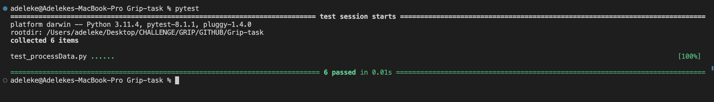

# Platform Engineer Test

## Javascript Function

The javascript test was done with jest and below is the image of the tests

## Python Functions
The python test was done with Pytest, below is the image of the tests result

## Different field names
If the list comes with different fiel names, to process the data, I will do the following
- Loop through the data list
- on each item of the data list I will check the data type associated with each keys
- if the data type is list, I will manipulate the key to be saved as data.offered_solutions
- if the data type of the key is a string, I will manipulate the key to be saved as name

## Lambda Deployment
The python code was deployed to AWS Lambda using Github Actions and Actions Secrets
The GitHub workflow file is located in .github/workflows/main.yaml
